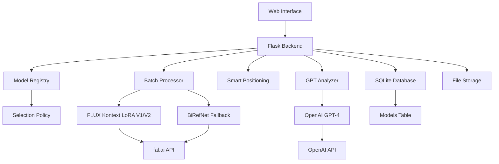

# 🎨 YM Image Processor - K+ Content Service

> **Автоматизированная система обработки изображений товаров с использованием AI технологий**

[](CHANGELOG.md)
[](requirements.txt)
[](Dockerfile)
[](LICENSE)

## 🚀 Возможности

### 🎯 Основные функции
- 🖼️ **Удаление фона** с помощью FLUX Kontext LoRA (V1/V2)
- 🧠 **GPT-4 анализ товаров** с детальным описанием
- 📦 **Пакетная обработка** множественных изображений
- ⚡ **Умное позиционирование** и композиция
- 📊 **Отслеживание прогресса** в реальном времени
- 💾 **История обработки** с базой данных

### 🎨 AI технологии
- **Model Registry** - Динамический выбор и управление моделями
- **FLUX Kontext LoRA V1/V2** - Удаление фона с собственными обученными моделями
- **OpenAI GPT-4 Vision** - Интеллектуальный анализ товаров
- **BiRefNet** - Универсальная fallback система
- **Smart Selection Policy** - Автоматический выбор оптимальной модели (V2→V1→BiRefNet)

## 🌐 Демо

**Production URL**: http://103.136.69.249:8080


## 🆕 Что нового в V2.0

### 📊 Model Registry System
- **Динамический выбор моделей** - Интерфейс для выбора модели обработки
- **Автоматический fallback** - Умная политика выбора V2→V1→BiRefNet
- **Детальная информация** - Просмотр характеристик, плюсов и минусов каждой модели
- **API управления** - REST API для работы с реестром моделей

### 🎛️ Новые возможности
- **GET /models** - Получение списка доступных моделей
- **GET /models/:id** - Детальная информация о модели
- **UI Model Selector** - Выпадающий список с карточками моделей
- **Логирование выбора** - Отслеживание какая модель и почему была выбрана

## 🏗️ Архитектура



## 📁 Структура проекта

```
K+ content service/
├── 📱 Приложения
│   ├── app_batch.py           # Главное приложение
│   └── app_api.py             # API версия
│
├── 🧠 Бизнес-логика
│   └── src/
│       ├── processors/        # Обработчики изображений
│       ├── models/           # Реестр моделей и политики
│       ├── database/         # Управление БД и миграции
│       └── utils/            # Вспомогательные утилиты
│
├── 📚 Документация
│   └── docs/
│       ├── TECHNICAL_OVERVIEW.md
│       ├── API_DOCUMENTATION.md
│       ├── DEPLOYMENT_GUIDE.md
│       └── ROADMAP.md
│
├── ⚙️ Конфигурация
│   ├── config/               # Конфигурационные файлы
│   ├── Dockerfile            # Docker образ
│   └── requirements.txt      # Python зависимости
│
├── 🔧 Скрипты
│   ├── scripts/              # Служебные скрипты
│   └── auto_deploy.sh        # Автоматическое развертывание
│
└── 📦 Архив
    └── archive/              # Устаревшие файлы
```

## ⚡ Быстрый старт

### 🐳 Docker (Рекомендуется)

```bash
# 1. Клонирование репозитория
git clone https://github.com/rslavai/ym-image-processor.git
cd ym-image-processor

# 2. Настройка переменных окружения
cat > .env << 'EOF'
FAL_KEY=your_fal_api_key_here
OPENAI_API_KEY=your_openai_api_key_here
LORA_PATH=https://v3.fal.media/files/rabbit/McQtMDl9HQ2cKh0_E-CrO_adapter_model.safetensors
PORT=8080
EOF

# 3. Запуск
docker build -t ym-processor .
docker run -d \
  --name ym-processor \
  --restart always \
  -p 8080:8080 \
  --env-file .env \
  ym-processor

# 4. Проверка
curl http://localhost:8080/health
```

### 🖥️ Локальная установка

```bash
# 1. Установка зависимостей
pip install -r requirements.txt

# 2. Настройка окружения
export FAL_KEY="your_fal_api_key"
export OPENAI_API_KEY="your_openai_api_key"

# 3. Запуск
python app_batch.py
```

### 🤖 Автоматическое развертывание

```bash
# Настройте auto_deploy.sh с вашими параметрами
./auto_deploy.sh
```

## 📖 Документация

| Документ | Описание |
|----------|----------|
| [📋 Техническое описание](docs/TECHNICAL_OVERVIEW.md) | Архитектура и технические детали |
| [📡 API документация](docs/API_DOCUMENTATION.md) | Полная документация API |
| [🚀 Руководство по развертыванию](docs/DEPLOYMENT_GUIDE.md) | Инструкции по установке |
| [🗺️ Roadmap](docs/ROADMAP.md) | Планы развития проекта |
| [📝 История изменений](CHANGELOG.md) | Лог всех изменений |

## 🔧 API Примеры

### Обработка одного изображения

```python
import requests

# Загрузка изображения
with open('product.jpg', 'rb') as f:
    response = requests.post(
        'http://103.136.69.249:8080/process_single',
        files={'file': f},
        data={'lora_version': 'v2'}
    )

processing_id = response.json()['processing_id']

# Отслеживание прогресса
progress = requests.get(f'http://103.136.69.249:8080/single_progress/{processing_id}')
print(progress.json())
```

### Пакетная обработка

```bash
curl -X POST http://103.136.69.249:8080/process_batch \
  -F "files=@image1.jpg" \
  -F "files=@image2.jpg" \
  -F "lora_version=v2"
```

## 🎨 Модели LoRA

### LoRA V1 (Базовая)
- **Время**: 15-25 секунд
- **Качество**: Хорошее для простых изображений
- **Шаги**: 30, Guidance: 2.5

### LoRA V2 (Улучшенная)
- **Время**: 25-40 секунд  
- **Качество**: Отличное для сложных изображений
- **Шаги**: 50, Guidance: 3.5

### BiRefNet (Fallback)
- **Время**: 5-10 секунд
- **Качество**: Базовое
- **Использование**: Автоматически при сбоях

## 🛠️ Технологии

**Backend**: Python 3.9+, Flask, SQLite, Pillow, OpenCV  
**AI/ML**: OpenAI GPT-4 Vision, fal.ai FLUX Kontext, BiRefNet  
**DevOps**: Docker, nginx, GitHub Actions  
**Frontend**: HTML5, CSS3, JavaScript, Bootstrap  

## 📊 Статус проекта

### ✅ Текущие возможности (v2.0)
- [x] Удаление фона с LoRA V1/V2
- [x] GPT-4 анализ товаров
- [x] Пакетная обработка
- [x] Веб-интерфейс
- [x] Docker контейнеризация
- [x] Автоматическое развертывание

### 🔄 В разработке (v2.1)
- [ ] Улучшенное позиционирование
- [ ] Генерация теней
- [ ] API v3 с аутентификацией
- [ ] Кеширование результатов

### 🎯 Планируется (v3.0)
- [ ] Мобильное приложение
- [ ] Интеграция с маркетплейсами
- [ ] Собственные AI модели
- [ ] Enterprise функции

## 🤝 Участие в разработке

### 🐛 Сообщение об ошибках
Создайте [Issue](https://github.com/rslavai/ym-image-processor/issues) с описанием проблемы.

### 🔀 Pull Requests
1. Fork репозитория
2. Создайте feature branch
3. Внесите изменения
4. Добавьте тесты
5. Отправьте PR

### 📝 Разработка
```bash
# Установка dev зависимостей
pip install -r requirements-dev.txt

# Запуск тестов
python -m pytest tests/ -v

# Форматирование кода
black src/ tests/

# Проверка качества
flake8 src/ tests/
```

## 📄 Лицензия

Этот проект лицензирован под MIT License - см. [LICENSE](LICENSE) файл.

## 📞 Поддержка

- **Документация**: [docs/](docs/)
- **Issues**: [GitHub Issues](https://github.com/rslavai/ym-image-processor/issues)
- **Email**: support@example.com
- **Production сервис**: http://103.136.69.249:8080

## 🙏 Благодарности

- **OpenAI** за GPT-4 Vision API
- **fal.ai** за FLUX Kontext и инфраструктуру
- **Сообществу** за feedback и тестирование

---

<div align="center">

**Сделано с ❤️ для улучшения e-commerce контента**

[⭐ Поставьте звезду](https://github.com/rslavai/ym-image-processor) | [📖 Документация](docs/) | [🚀 Demo](http://103.136.69.249:8080)

</div>